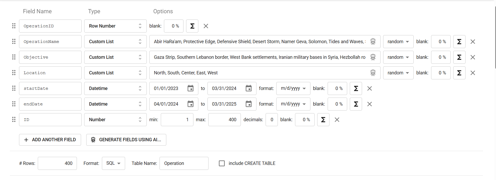

# פרויקט בסיסי נתונים
הדר מהסרי-213953029
הודיה -329385413

יחידה נבחרת: operations branch
## תוכן עניינים
- מבוא
- תיאור המערכת
- תרשימי מערכת
- דיאגרמת יחסי ישויות-ERD 
- דיאגרמת סכמת נתונים-DSD
- החלטות עיצוב
- מבנה הטבלאות
- הכנסת נתונים
- שאילתות

 
 ### מבוא
מסמך זה מתאר את שלב א' בפרויקט מערכת ניהול מבצעים צבאית. המערכת מיועדת לניהול מידע על מבצעים צבאיים, יחידות המשתתפות בהם, המפקדים האחראים, הציוד הנדרש, המשימות הספציפיות והדוחות המבצעיים.

 ### תיאור המערכת
המערכת מיועדת לניהול ומעקב אחר מבצעים צבאיים על כל מרכיביהם. היא מאפשרת:

- תיעוד מבצעים צבאיים כולל מטרות, מיקומים ותאריכים
- ניהול יחידות צבאיות והשיוך שלהן לחילות השונים
- ניהול מפקדים, דרגותיהם וניסיונם
- מעקב אחר ציוד המשמש במבצעים
- ניהול משימות ספציפיות במסגרת כל מבצע
- תיעוד דוחות מבצעיים

המערכת מספקת את הפונקציונליות העיקרית הבאה:

הקצאת יחידות למבצעים
הקצאת ציוד למבצעים
תזמון משימות במסגרת מבצעים
מעקב אחר דוחות והתקדמות המבצעים
ניהול היררכיית הפיקוד והאחריות

 ### תרשימי מערכת
ERD - דיאגרמת יחסי ישויות
דיאגרמת ה-ERD מתארת את הישויות במערכת ואת היחסים ביניהן:

הישויות העיקריות במערכת:

מבצע (Operation) - הישות המרכזית המתארת מבצע צבאי
מפקד (Commander) - מפקדים האחראים על מבצעים
חיל (Corps) - החילות השונים בצבא
יחידה (Unit) - יחידות צבאיות המשתייכות לחילות
ציוד (Equipment) - ציוד צבאי המשמש במבצעים
משימה (Task) - משימות ספציפיות במסגרת מבצעים
דו"ח מבצעי (Operational Report) - דוחות על מבצעים

היחסים בין הישויות:

מוביל (Leads) - מפקד מוביל מבצע (יחס 1)
בוצע על ידי (Executed by) - מבצע מבוצע על ידי יחידות (יחס N)
מתזמן (Schedules) - מבצע כולל משימות (יחס 1)
דורש (Requires) - מבצע דורש ציוד (יחס N)
שייך ל (Belongs to) - יחידה שייכת לחיל (יחס N:1)
מתעד (Documents) - דוח מתעד מבצע (יחס N:1)

DSD - דיאגרמת סכמת נתונים
דיאגרמת ה-DSD מציגה את הטבלאות במסד הנתונים והקשרים ביניהן:

### החלטות עיצוב
במהלך תכנון המערכת התקבלו מספר החלטות עיצוב:

- שימוש במספרים רצים (SERIAL) - בחרנו להשתמש במספרים רצים עבור המפתחות הראשיים בכל הטבלאות כדי לפשט את תהליך ההוספה של נתונים חדשים ולמנוע שגיאות.
- הפרדה בין חיל ליחידה - החלטנו להפריד את החילות והיחידות לטבלאות נפרדות כדי לשקף את המבנה ההיררכי הצבאי ולאפשר שיוך של יחידות לחילות.
- ניהול קשרים רבים-לרבים (N) - עבור הקשרים בין מבצעים ליחידות ובין מבצעים לציוד, יצרנו טבלאות קשר מפורשות (Executed_by ו-Requires) כדי לנהל את הקשרים הרבים-לרבים.
- תיעוד זמנים של משימות - בחרנו לכלול שדות StartTime ו-EndTime בטבלת Task כדי לאפשר תזמון מדויק של משימות במסגרת המבצעים.

### מבנה הטבלאות 
להלן מבנה הטבלאות שיצרנו במסד הנתונים:

### הכנסת נתונים
שיטה 1 - Mockaroo
עבור טבלת commander:

עבור טבלת crops:

עבור טבלת operation:

שיטה 2- הכנסת נתונים מקבצי אקסל
עבור טבלת Equipment:

עבור טבלת OperationalReport:

עבור טבלת Unit:

שיטה 3- הכנסת נתונים דרך פייתון
עבור טבלת Executed_by:

עבור טבלת Task:

עבור טבלת Rrequires:

### גיבוי

ביצוע גיבוי: 

ביצוע שחזור:
יצרתי database חדש בשם backup על מנת לראות אם השחזור צלח.
ובהחלט 9 הטבלאות שוחזרו בהצלחה עם כל הנתונים. צירפתי דוגמא לטבלת unit בעלת 403 רשומות.

  
### שאילתות
1.השאילתה מציגה את כל המבצעים (Operations) שדורשים יותר ציוד מהממוצע הכללי של ציוד למבצע.
לכל מבצע מוצגים מזהה המבצע, שמו, וכמות הציודים הנדרשים לו, בסדר יורד לפי כמות הציוד.

  

2.השאילתה מחזירה את כל המפקדים שיש להם יותר מ־10 שנות ניסיון, אך אינם מובילים כרגע אף מבצע פעיל (כלומר, מבצע שטרם הסתיים).
הרשימה ממויינת לפי שנות הניסיון מהגבוה לנמוך.

3. השאילתה מחפשת מבצעים (Operations) שיש להם יותר משימות (Tasks) מהממוצע הכללי של משימות למבצע.
לכל מבצע מוצגים מזהה, שם, וכמות המשימות, כשהתוצאה ממויינת בסדר יורד לפי מספר המשימות.

  

  
  
4.השאילתה מציגה את כל היחידות (Units) בצבא, יחד עם חיל השייכות שלהן והתמחות החיל,
ומחשבת עבור כל יחידה את מספר המבצעים (Operations) שבהם השתתפה – ממויין מהכי פעילה לפחות.

  

5.השאילתה מציגה את כל המבצעים (Operations) שנמשכו יותר מ־500 ימים, כולל מזהה המבצע, שמו, תאריך התחלה, תאריך סיום ומשך בימים.
התוצאה ממוינת כך שהמבצע הארוך ביותר מופיע ראשון.

6.

