

# פרויקט בסיסי נתונים
הדר מהסרי-213953029
הודיה גומה-329385413

יחידה נבחרת: operations branch
## תוכן עניינים
- מבוא
- תיאור המערכת
- תרשימי מערכת
- דיאגרמת יחסי ישויות-ERD 
- דיאגרמת סכמת נתונים-DSD
- החלטות עיצוב
- מבנה הטבלאות
- הכנסת נתונים
- שאילתות

 
 ### מבוא
מסמך זה מתאר את שלב א' בפרויקט מערכת ניהול מבצעים צבאית. המערכת מיועדת לניהול מידע על מבצעים צבאיים, יחידות המשתתפות בהם, המפקדים האחראים, הציוד הנדרש, המשימות הספציפיות והדוחות המבצעיים.

 ### תיאור המערכת
המערכת מיועדת לניהול ומעקב אחר מבצעים צבאיים על כל מרכיביהם. היא מאפשרת:

- תיעוד מבצעים צבאיים כולל מטרות, מיקומים ותאריכים
- ניהול יחידות צבאיות והשיוך שלהן לחילות השונים
- ניהול מפקדים, דרגותיהם וניסיונם
- מעקב אחר ציוד המשמש במבצעים
- ניהול משימות ספציפיות במסגרת כל מבצע
- תיעוד דוחות מבצעיים

המערכת מספקת את הפונקציונליות העיקרית הבאה:

הקצאת יחידות למבצעים
הקצאת ציוד למבצעים
תזמון משימות במסגרת מבצעים
מעקב אחר דוחות והתקדמות המבצעים
ניהול היררכיית הפיקוד והאחריות

 ### תרשימי מערכת
ERD - דיאגרמת יחסי ישויות
דיאגרמת ה-ERD מתארת את הישויות במערכת ואת היחסים ביניהן:
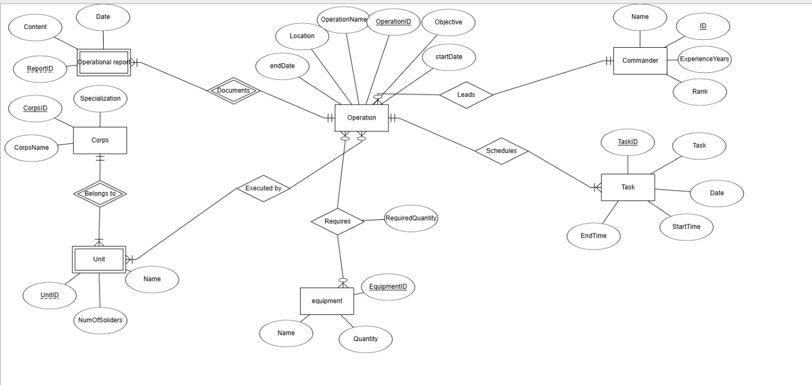
הישויות העיקריות במערכת:

מבצע (Operation) - הישות המרכזית המתארת מבצע צבאי
מפקד (Commander) - מפקדים האחראים על מבצעים
חיל (Corps) - החילות השונים בצבא
יחידה (Unit) - יחידות צבאיות המשתייכות לחילות
ציוד (Equipment) - ציוד צבאי המשמש במבצעים
משימה (Task) - משימות ספציפיות במסגרת מבצעים
דו"ח מבצעי (Operational Report) - דוחות על מבצעים

היחסים בין הישויות:

מוביל (Leads) - מפקד מוביל מבצע (יחס 1)
בוצע על ידי (Executed by) - מבצע מבוצע על ידי יחידות (יחס N)
מתזמן (Schedules) - מבצע כולל משימות (יחס 1)
דורש (Requires) - מבצע דורש ציוד (יחס N)
שייך ל (Belongs to) - יחידה שייכת לחיל (יחס N:1)
מתעד (Documents) - דוח מתעד מבצע (יחס N:1)

DSD - דיאגרמת סכמת נתונים
דיאגרמת ה-DSD מציגה את הטבלאות במסד הנתונים והקשרים ביניהן:
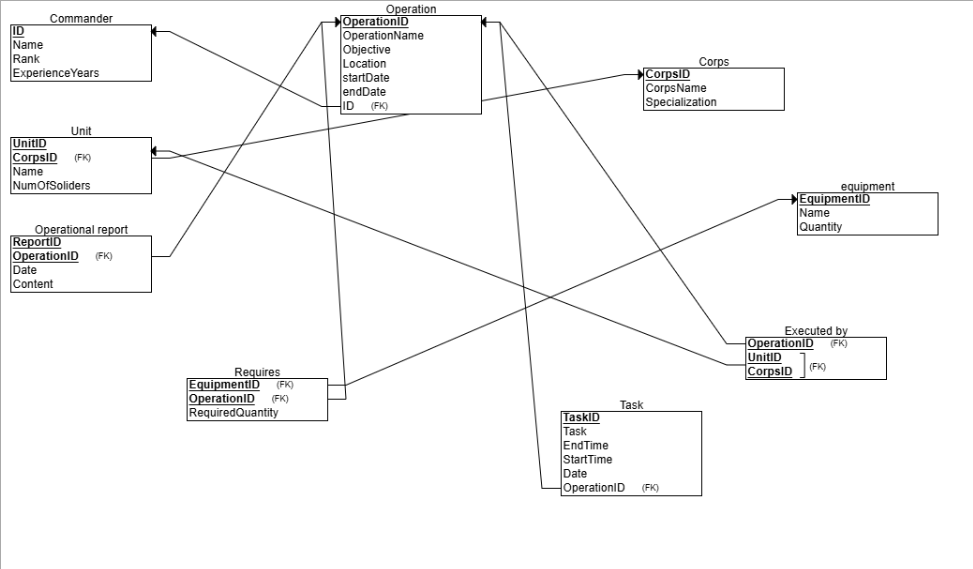
### החלטות עיצוב
במהלך תכנון המערכת התקבלו מספר החלטות עיצוב:

- שימוש במספרים רצים (SERIAL) - בחרנו להשתמש במספרים רצים עבור המפתחות הראשיים בכל הטבלאות כדי לפשט את תהליך ההוספה של נתונים חדשים ולמנוע שגיאות.
- הפרדה בין חיל ליחידה - החלטנו להפריד את החילות והיחידות לטבלאות נפרדות כדי לשקף את המבנה ההיררכי הצבאי ולאפשר שיוך של יחידות לחילות.
- ניהול קשרים רבים-לרבים (N) - עבור הקשרים בין מבצעים ליחידות ובין מבצעים לציוד, יצרנו טבלאות קשר מפורשות (Executed_by ו-Requires) כדי לנהל את הקשרים הרבים-לרבים.
- תיעוד זמנים של משימות - בחרנו לכלול שדות StartTime ו-EndTime בטבלת Task כדי לאפשר תזמון מדויק של משימות במסגרת המבצעים.

### מבנה הטבלאות 
להלן מבנה הטבלאות שיצרנו במסד הנתונים:

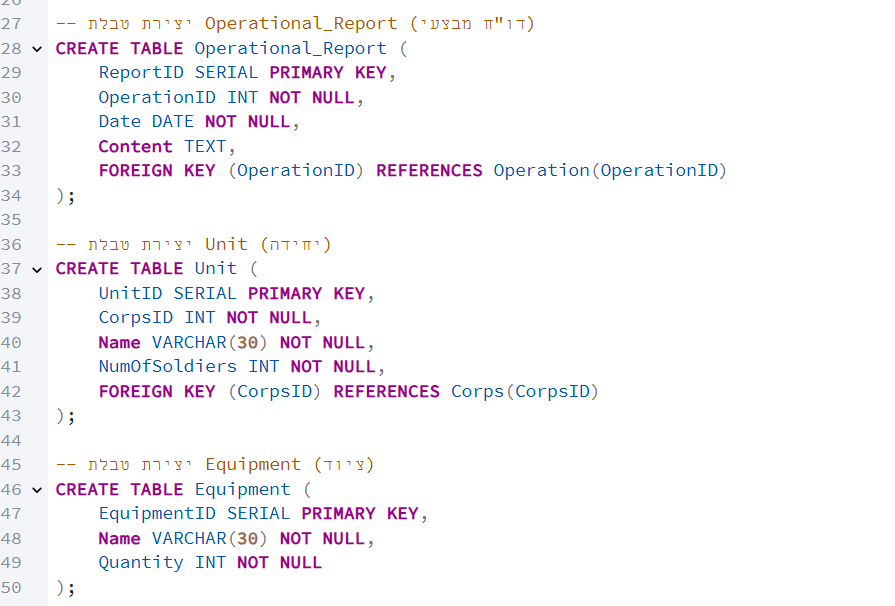
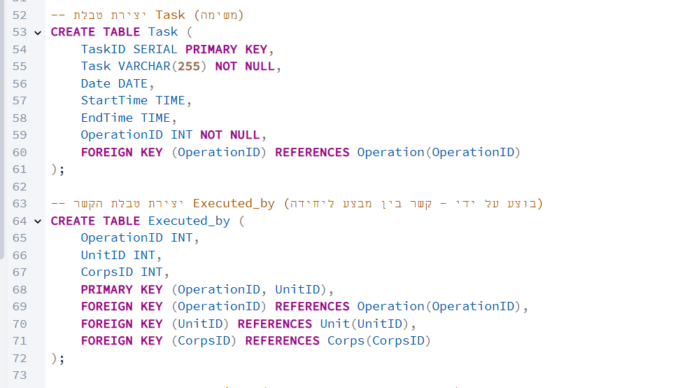\

### הכנסת נתונים
שיטה 1 - Mockaroo
עבור טבלת commander:

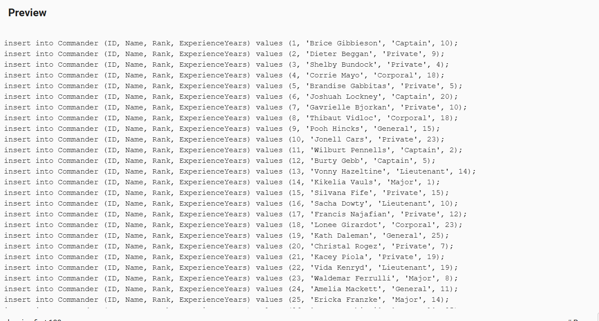
עבור טבלת corps:
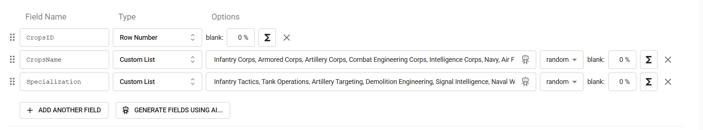
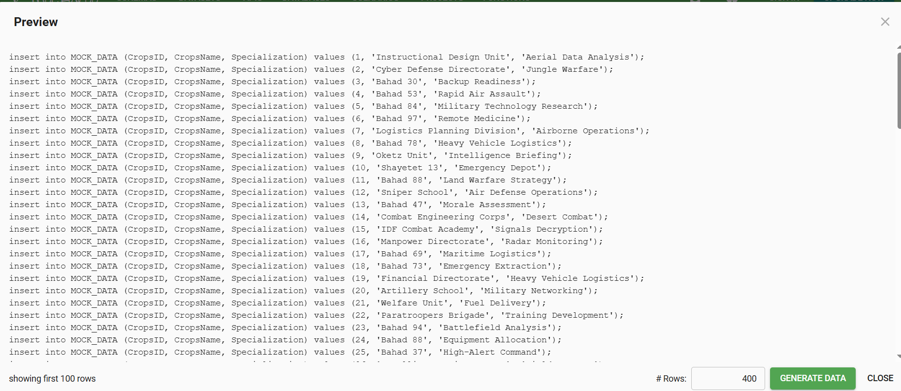

עבור טבלת operation:

שיטה 2- הכנסת נתונים מקבצי אקסל
עבור טבלת Equipment:

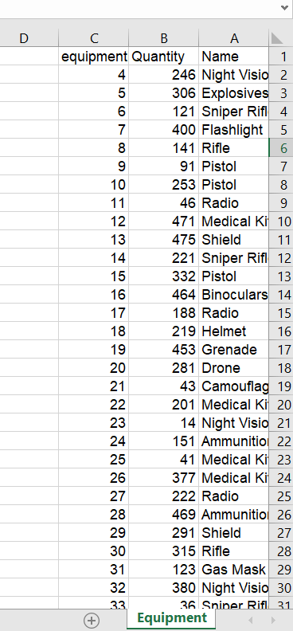

עבור טבלת OperationalReport:

עבור טבלת Unit:

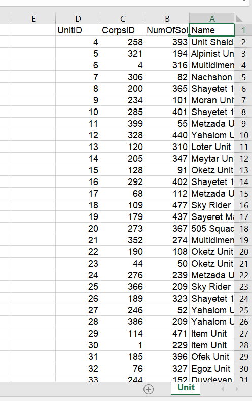

שיטה 3- הכנסת נתונים דרך פייתון
עבור טבלת Executed_by:

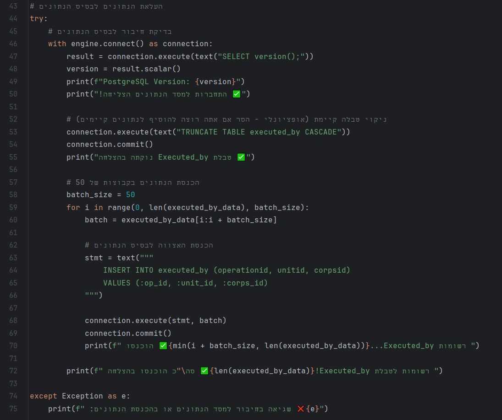

עבור טבלת Task:
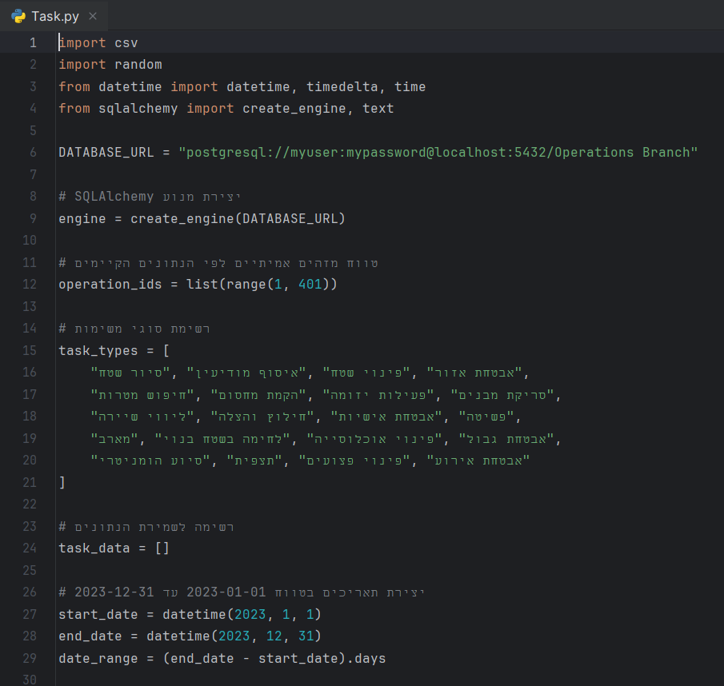
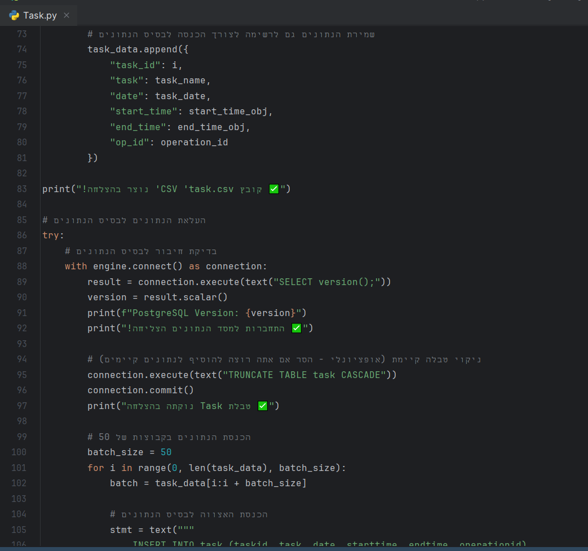

עבור טבלת Requires:
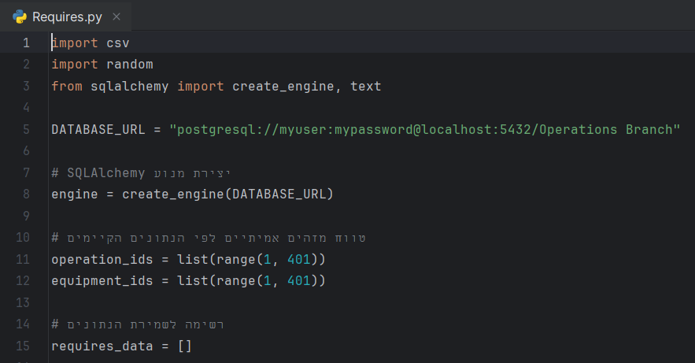
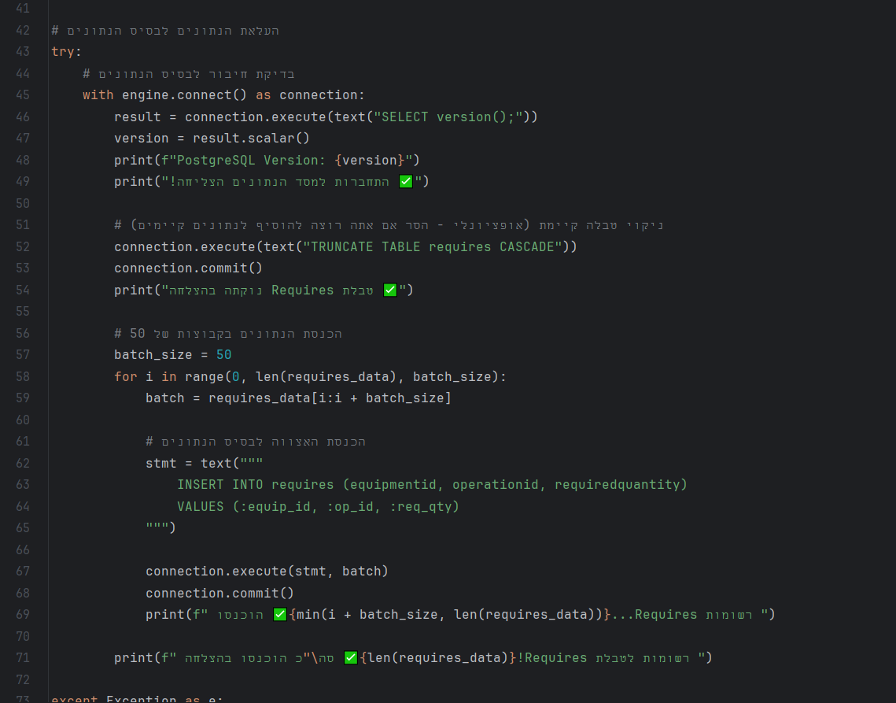

### גיבוי

ביצוע גיבוי: 

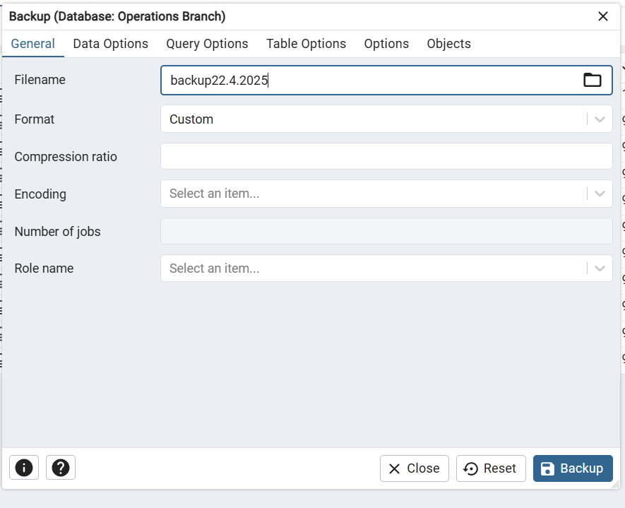

ביצוע שחזור:
יצרתי database חדש בשם backup על מנת לראות אם השחזור צלח.
ובהחלט 9 הטבלאות שוחזרו בהצלחה עם כל הנתונים. צירפתי דוגמא לטבלת unit בעלת 403 רשומות.

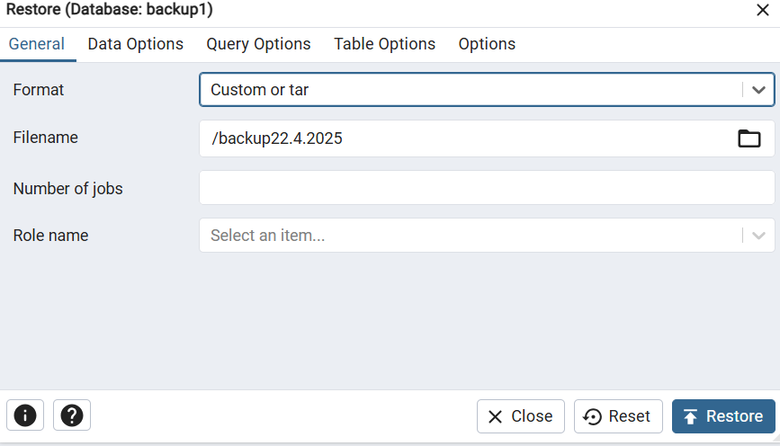

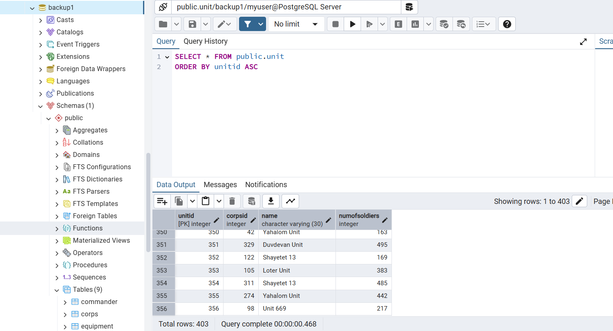 

## שאילתות

**1.השאילתה מציגה את כל המבצעים (Operations) שדורשים יותר ציוד מהממוצע הכללי של ציוד למבצע.
לכל מבצע מוצגים מזהה המבצע, שמו, וכמות הציודים הנדרשים לו, בסדר יורד לפי כמות הציוד.**

  

**2.השאילתה מחזירה את כל המפקדים שיש להם יותר מ־10 שנות ניסיון, אך אינם מובילים כרגע אף מבצע פעיל (כלומר, מבצע שטרם הסתיים).
הרשימה ממויינת לפי שנות הניסיון מהגבוה לנמוך.**

**3. השאילתה מחפשת מבצעים (Operations) שיש להם יותר משימות (Tasks) מהממוצע הכללי של משימות למבצע.
לכל מבצע מוצגים מזהה, שם, וכמות המשימות, כשהתוצאה ממויינת בסדר יורד לפי מספר המשימות.**

  

  
  
**4.השאילתה מציגה את כל היחידות (Units) בצבא, יחד עם חיל השייכות שלהן והתמחות החיל,
ומחשבת עבור כל יחידה את מספר המבצעים (Operations) שבהם השתתפה – ממויין מהכי פעילה לפחות.**

  

**5.השאילתא בוחרת את מזהה הפעולה, שם הפעולה, תאריך התחלה ותאריך סיום של פעולות, ומחלקת את זמן הפעולה לפי ימים (DurationDays). 
היא מחזירה רק פעולות שמשך הזמן שלהן מעל 500 ימים וממיינת את התוצאות בסדר יורד לפי משך הזמן.**

**6.השאילתא בוחרת את מזהה הציוד, שם הציוד, כמות הציוד הזמינה, מספר הפעמים שהציוד שומש בפעולות, וסך הכמות שנדרשה בכל הפעולות.
היא מציגה ציוד ששומש ביותר מפעם אחת, וממיינת את התוצאות בסדר יורד לפי מספר השימושים.**

**7.השאילתא מציגה משימות שבוצעו במהלך חודש פברואר 2023, כולל מזהה המשימה, תיאורה, תאריך, שעת התחלה, שעת סיום ושם הפעולה שאליה היא שייכת.
התוצאות ממוינות לפי תאריך המשימה ושעת ההתחלה.**

**8.השאילתא מציגה את מספר הפעולות שהחלו בכל חודש בשנת 2023. היא מחלקת את התוצאות לפי חודש ומציינת את מספר הפעולות שהחלו בכל אחד מהם, כשהמיון נעשה לפי מספר החודש בסדר עולה.**

  ### שאילתות עדכון

 **1.השאילתא מעדכנת את דרגת המפקדים בטבלה Commander, כך שכל מפקד שיש לו יותר מ־20 שנות ניסיון ואינו בדרגת "General", יקודם לדרגה זו.**

**2.השאילתה מעדכנת את עמודת תאריך הסיום (endDate) של פעולות שהסתיימו בפברואר 2023.
לכל פעולה כזו מתווספים 3 ימים לתאריך הסיום.**

**3. השאילתה מעדכנת את עמודת Specialization לחיל האוויר בערך "Tactical Navigation".
העדכון יתבצע רק אם השדה ריק או לא הוזן בו ערך קודם (NULL או מחרוזת ריקה).**

  ### שאילתות מחיקה
**1.השאילתה מוחקת את כל המשימות מהטבלה Task שתאריך הביצוע שלהן לפני 1 בינואר 2023.
המטרה היא לנקות נתונים ישנים שאינם רלוונטיים עוד.**

**2.השאילתה מוחקת ציוד מהטבלה Equipment שאינו נדרש לאף משימה לפי הטבלה Requires.
כלומר, היא מסירה ציוד שאין לו שימוש נוכחי במערכת.**

**3.השאילתה מוחקת רשומות מטבלת Requires שבהן מזהה הפעולה (OperationID) קיים גם בטבלת Operation, והפעולה הסתיימה לפני יותר מחודש.
היא משתמשת ב-USING כדי לבצע מחיקה מותנית על בסיס התאמה בין שתי טבלאות.**

## rollback ו-commit
**commit:**

**rollback:**

## אילוצים

###   Check אילוצי 

###   Not NULL אילוצי 

###   Deafult אילוצי 

# שלב ג

-DSD של האגף החדש:

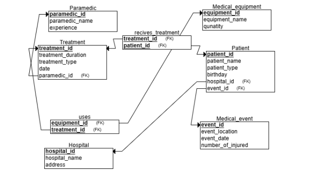

-ERD של האגף החדש:

 

-ERD של האינטגרציה: 

-DSD של האינטגרציה:

 
 

## דוח שלב האינטגרציה - מערכת מידע רפואי וצבאית
  ### *החלטות שנעשו בשלב האינטגרציה*
**1. החלטה על מבנה הירושה**
החלטה: יצירת טבלת Soldier כטבלת אב משותפת לישויות Commander, Paramedic ו-Patient.
נימוק:

כל שלושת הסוגים הם בעצם חיילים עם תפקידים שונים
מאפשר ניהול מאוחד של מידע בסיסי (שם, מזהה)
יוצר היררכיה לוגית המשקפת את המציאות הצבאית

**2.  החלטה על טווחי מזהים נפרדים**

מפקדים: 1,000,000 + מזהה מקורי (טווח: 1,000,001 - 1,999,999)
פרמדיקים: 2,000,000 + מזהה מקורי (טווח: 2,000,001 - 2,999,999)
מטופלים: 3,000,000 + מזהה מקורי (טווח: 3,000,001 - 3,999,999)

נימוק:

מניעת התנגשויות בין מזהים מטבלאות שונות
זיהוי מיידי של סוג החייל לפי טווח המזהה
שמירה על פשטות המבנה ללא עמודות נוספות

**3. החלטה על שמות עמודות**
החלטה: שמירה על השמות המקוריים של העמודות (commander_id, paramedic_id, patient_id).
נימוק:

שמירה על תאימות עם קוד ומערכות קיימות
הבנה אינטואיטיבית של התפקיד לפי שם העמודה
הימנעות משינויים נרחבים בטבלאות הקשר

**4. החלטה על מיזוג טבלאות ציוד**
החלטה: שימוש במפתח מורכב (EquipmentID, equipment_type) במקום שינוי מזהים.
נימוק:

שמירה על המזהים המקוריים של הציוד
גמישות להוספת סוגי ציוד נוספים בעתיד
טבלה אחת לכל סוגי הציוד האפשריים (צבאי ורפואי)

**5. החלטה על קישור אירועים רפואיים למבצעים**
החלטה: קישור לפי תאריכים - אירוע רפואי שהתרחש בין תאריך התחלה וסיום של מבצע מקושר אליו.
נימוק:

קישור הגיוני המבוסס על זמן התרחשות
במבצע יכולים להתרחש מספר אירועים רפואיים

### הסבר מילולי של התהליך והפקודות

#### שלב 1: הכנה ליצירת הירושה

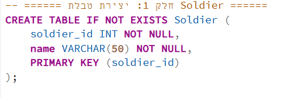

**הסבר: יצירת טבלת האב 
Soldier עם מבנה מינימלי - רק מזהה ושם. טבלה זו תשמש בסיס לכל סוגי החיילים.**

#### שלב 2: עדכון טבלת המפקדים

**הסבר: לפני שינוי מבנה הטבלה, חובה להסיר את כל האילוצים התלויים בה. קודם מסירים מפתחות זרים מטבלאות אחרות שמצביעות לטבלה, ואז את המפתח הראשי של הטבלה עצמה.**

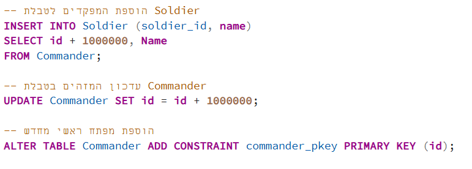

**הסבר: הוספת המפקדים לטבלת האב עם המזהים החדשים (מקורי + מיליון), ואז עדכון המזהים בטבלת המפקדים עצמה להתאמה.**

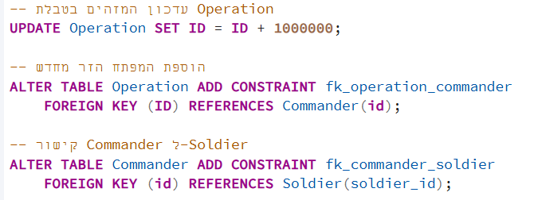

**הסבר: עדכון כל הטבלאות שמפנות למפקדים כדי להתאים למזהים החדשים, ויצירת המפתחות מחדש לאחר השינויים.**

#### שלב 3: עדכון טבלת הפרמדיקים
התהליך זהה לשלב המפקדים, אך עם הוספת 2,000,000 למזהים:

#### שלב 4: עדכון טבלת המטופלים

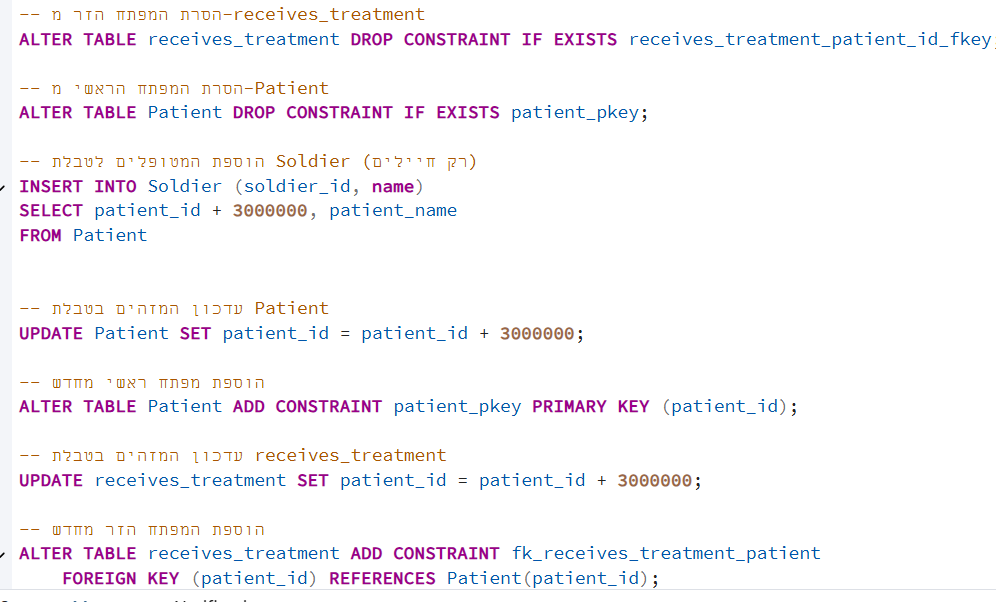

#### שלב 5: מיזוג טבלאות ציוד

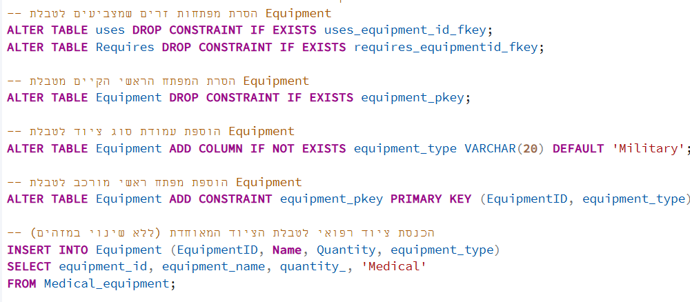

**הסבר: במקום לשנות מזהים, אנחנו יוצרים מפתח מורכב שמורכב ממזהה הציוד וסוגו. זה מאפשר לאותו מזהה להתקיים פעמיים - פעם אחת כציוד צבאי ופעם כציוד רפואי.**

**הסבר: העתקת הציוד הרפואי לטבלת הציוד המאוחדת עם שמירה על המזהים המקוריים וסימון הסוג כ-'Medical'.**

#### שלב 6: עדכון טבלאות הקשר לציוד

**הסבר: הוספת עמודת סוג ציוד לטבלאות הקשר ועדכון הערכים בהתאם. ציוד שמופיע בטבלת הציוד הרפואי מסומן כ-'Medical'.**

**הסבר: יצירת מפתח זר מורכב שמתאים למפתח הראשי המורכב של טבלת הציוד.**

#### שלב 7: קישור אירועים רפואיים למבצעים

**הסבר: הוספת עמודה לקישור אירועים רפואיים למבצעים, ועדכון אוטומטי של הקישורים לפי תאריכים. אירוע שהתרחש בזמן מבצע מקושר אליו.**

### מבטים-Views

### View1
🏥 מבט 1: האגף הרפואי - Active_Paramedics
תכלית המבט
מבט המיועד לניהול הצוות הרפואי ומתמקד בביצועי הפרמדיקים והטיפולים שהם מעניקים.

טבלאות מעורבות:

Paramedic -
 מידע על הפרמדיקים (מזהה, שם, ניסיון)

Treatment - 
מידע על הטיפולים שניתנו (משך, סוג, תאריך)

שאילתא-1
-- שאילתה 1: מיהם הפרמדיקים הכי פעילים?
-- שאלה מעשית: איזה פרמדיקים נותנים הכי הרבה טיפולים?

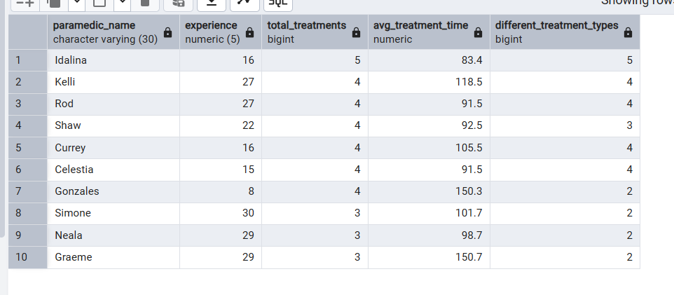

שאילתא-2
-- שאילתה 2: איזה פרמדיקים צריכים עזרה או הכשרה?
-- שאלה מעשית: מי הפרמדיקים החדשים או הפחות פעילים שצריכים תמיכה?

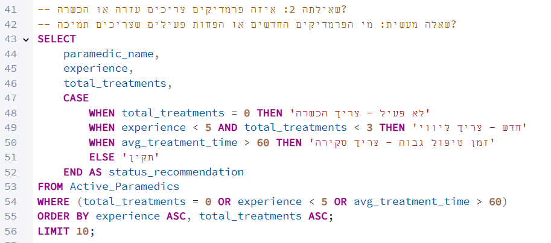

### View2

 מבט 2: האגף הצבאי - Units_In_Operations
תכלית המבט
מבט המיועד לניהול הכוחות והמבצעים ומתמקד בהשתתפות יחידות במבצעים שונים.
טבלאות מעורבות:

Operation -
 מידע על המבצעים (שם, מיקום, תאריכים)

Executed_by -
טבלת קשר בין מבצעים ליחידות

Unit - 
מידע על היחידות (שם, כמות חיילים)

Corps -
 מידע על החילות (שם, התמחות)

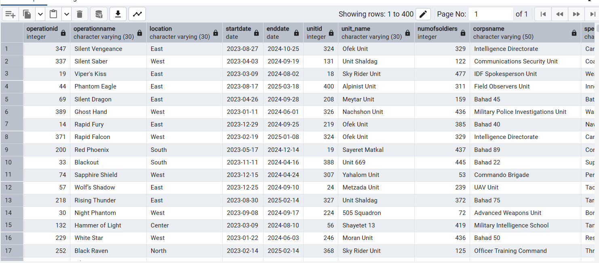

שאילתא-1

-- שאילתה 1: איזה יחידות הכי פעילות?
-- שאלה פשוטה: אילו יחידות השתתפו בהכי הרבה מבצעים?

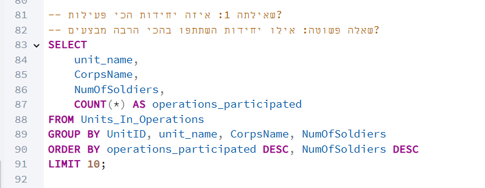

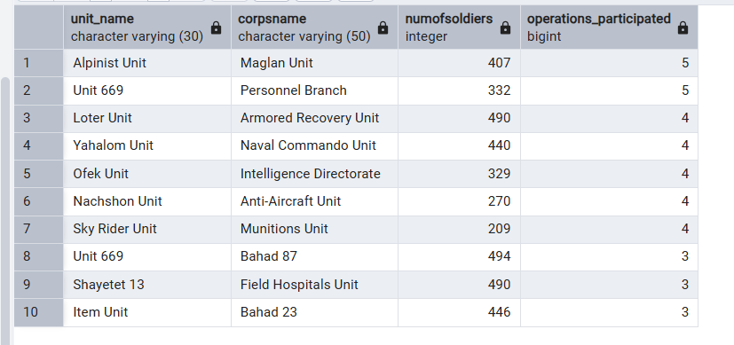

שאילתא-2

-- שאילתה 2: איזה חילות הכי נדרשים?
-- שאלה פשוטה: איזה סוגי חילות הכי הרבה פעמים נקראים למבצעים?

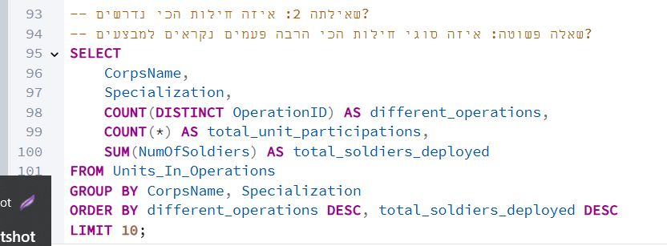

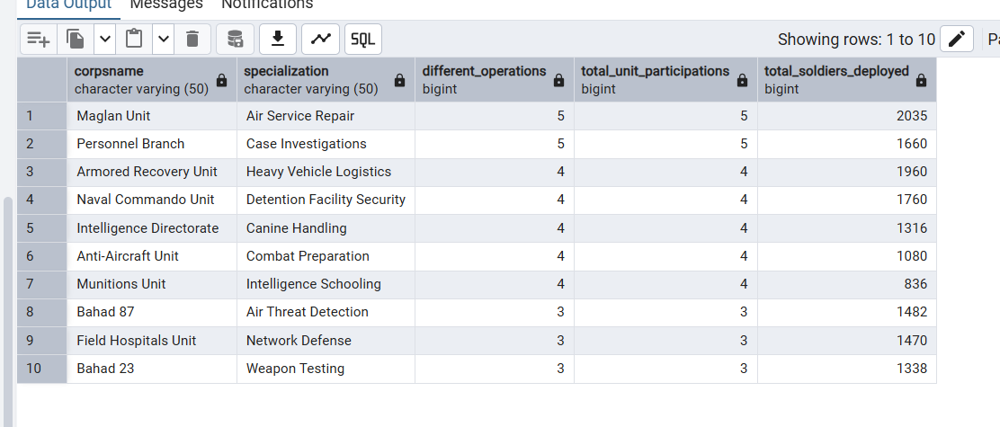

