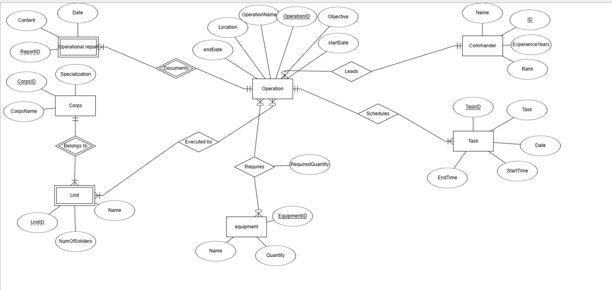
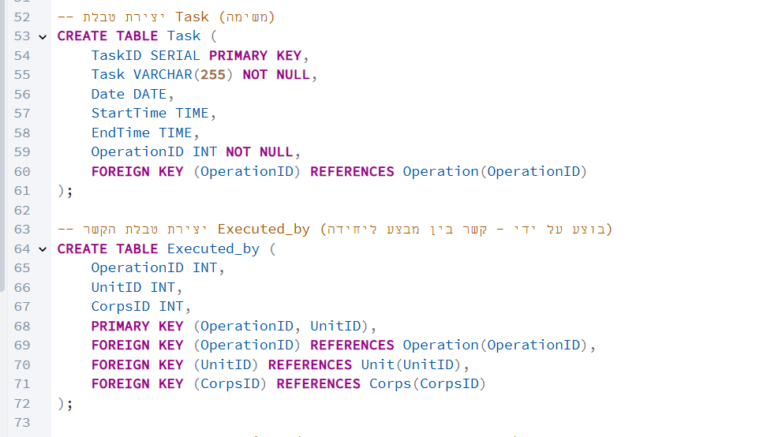
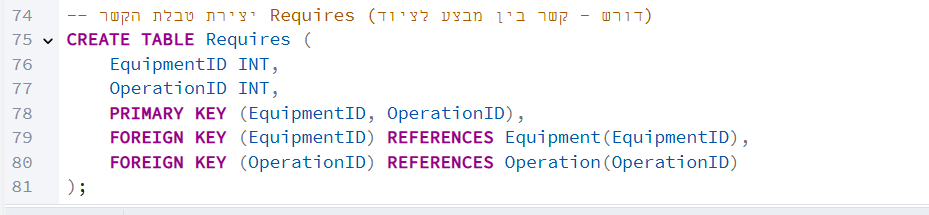
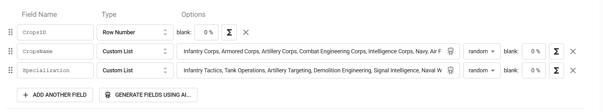
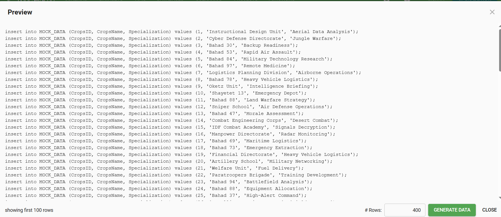
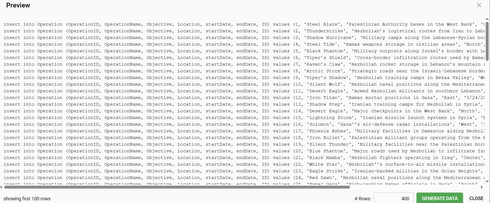

# פרויקט בסיסי נתונים
הדר מהסרי-213953029
הודיה -

יחידה נבחרת: operations branch
## תוכן עניינים
- מבוא
- תיאור המערכת
- תרשימי מערכת
- דיאגרמת יחסי ישויות-ERD 
- דיאגרמת סכמת נתונים-DSD
- החלטות עיצוב
- מבנה הטבלאות
- הכנסת נתונים

 
 ### מבוא
מסמך זה מתאר את שלב א' בפרויקט מערכת ניהול מבצעים צבאית. המערכת מיועדת לניהול מידע על מבצעים צבאיים, יחידות המשתתפות בהם, המפקדים האחראים, הציוד הנדרש, המשימות הספציפיות והדוחות המבצעיים.

 ### תיאור המערכת
המערכת מיועדת לניהול ומעקב אחר מבצעים צבאיים על כל מרכיביהם. היא מאפשרת:

- תיעוד מבצעים צבאיים כולל מטרות, מיקומים ותאריכים
- ניהול יחידות צבאיות והשיוך שלהן לחילות השונים
- ניהול מפקדים, דרגותיהם וניסיונם
- מעקב אחר ציוד המשמש במבצעים
- ניהול משימות ספציפיות במסגרת כל מבצע
- תיעוד דוחות מבצעיים

המערכת מספקת את הפונקציונליות העיקרית הבאה:

הקצאת יחידות למבצעים
הקצאת ציוד למבצעים
תזמון משימות במסגרת מבצעים
מעקב אחר דוחות והתקדמות המבצעים
ניהול היררכיית הפיקוד והאחריות

 ### תרשימי מערכת
ERD - דיאגרמת יחסי ישויות
דיאגרמת ה-ERD מתארת את הישויות במערכת ואת היחסים ביניהן:

הישויות העיקריות במערכת:

מבצע (Operation) - הישות המרכזית המתארת מבצע צבאי
מפקד (Commander) - מפקדים האחראים על מבצעים
חיל (Corps) - החילות השונים בצבא
יחידה (Unit) - יחידות צבאיות המשתייכות לחילות
ציוד (Equipment) - ציוד צבאי המשמש במבצעים
משימה (Task) - משימות ספציפיות במסגרת מבצעים
דו"ח מבצעי (Operational Report) - דוחות על מבצעים

היחסים בין הישויות:

מוביל (Leads) - מפקד מוביל מבצע (יחס 1)
בוצע על ידי (Executed by) - מבצע מבוצע על ידי יחידות (יחס N)
מתזמן (Schedules) - מבצע כולל משימות (יחס 1)
דורש (Requires) - מבצע דורש ציוד (יחס N)
שייך ל (Belongs to) - יחידה שייכת לחיל (יחס N:1)
מתעד (Documents) - דוח מתעד מבצע (יחס N:1)

DSD - דיאגרמת סכמת נתונים
דיאגרמת ה-DSD מציגה את הטבלאות במסד הנתונים והקשרים ביניהן:

### החלטות עיצוב
במהלך תכנון המערכת התקבלו מספר החלטות עיצוב:

- שימוש במספרים רצים (SERIAL) - בחרנו להשתמש במספרים רצים עבור המפתחות הראשיים בכל הטבלאות כדי לפשט את תהליך ההוספה של נתונים חדשים ולמנוע שגיאות.
- הפרדה בין חיל ליחידה - החלטנו להפריד את החילות והיחידות לטבלאות נפרדות כדי לשקף את המבנה ההיררכי הצבאי ולאפשר שיוך של יחידות לחילות.
- ניהול קשרים רבים-לרבים (N) - עבור הקשרים בין מבצעים ליחידות ובין מבצעים לציוד, יצרנו טבלאות קשר מפורשות (Executed_by ו-Requires) כדי לנהל את הקשרים הרבים-לרבים.
- תיעוד זמנים של משימות - בחרנו לכלול שדות StartTime ו-EndTime בטבלת Task כדי לאפשר תזמון מדויק של משימות במסגרת המבצעים.

### מבנה הטבלאות 
להלן מבנה הטבלאות שיצרנו במסד הנתונים:

### הכנסת נתונים
שיטה 1 - Mockaroo
עבור טבלת commander:

עבור טבלת crops:

עבור טבלת operation:

